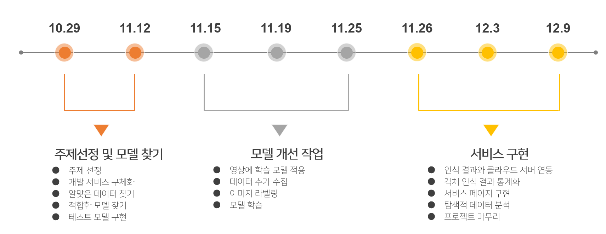
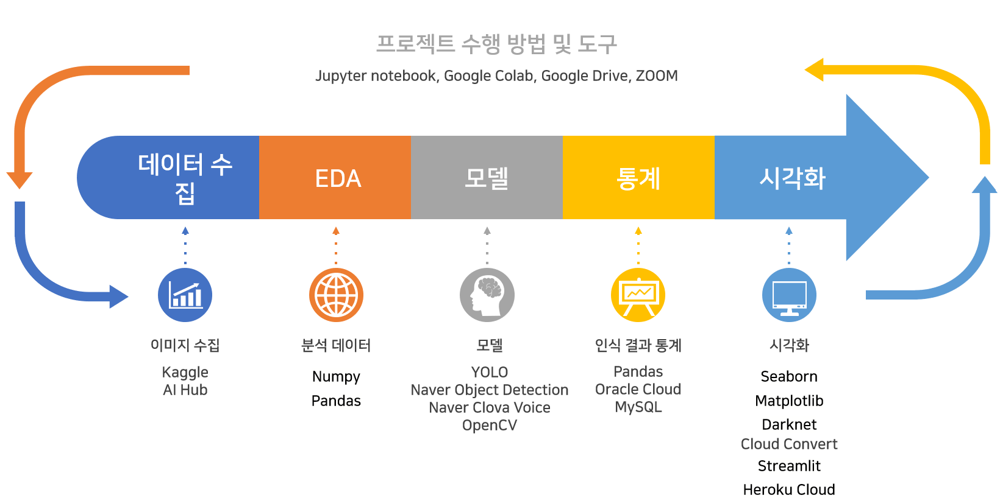
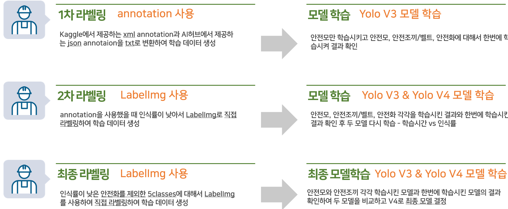
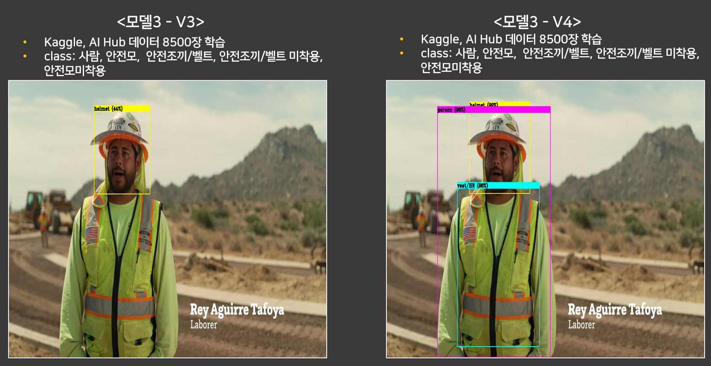
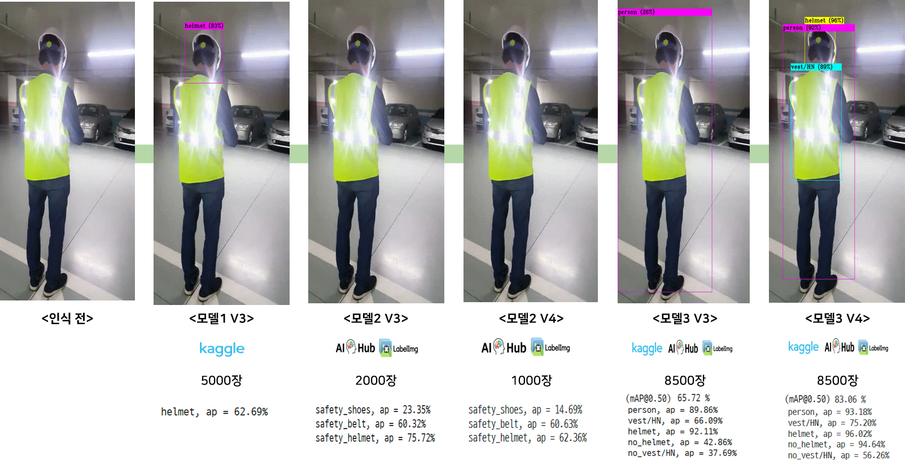
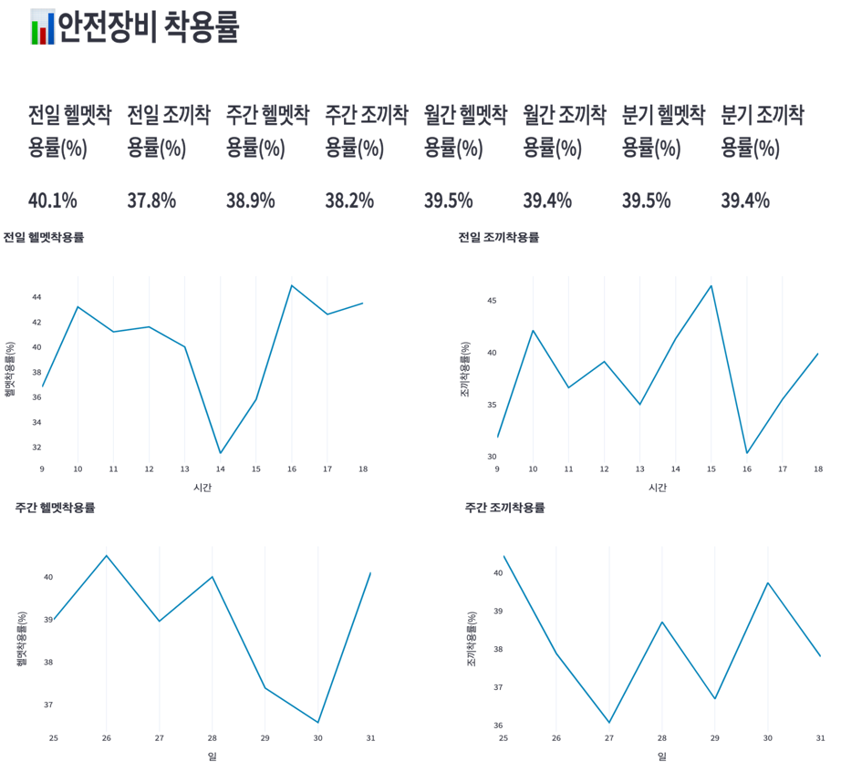

<h1>건설현장 안전장비 착용여부 인식 서비스 개발</h1>

'빅데이터 기반 지능형 서비스 개발 과정' 최종프로젝트 3조 안전하조

[김범진](https://github.com/BijetK) [김진영](onclick="location.href=') 박황미 [장근영](https://github.com/GYoungJang) 

[pdf](https://github.com/Jiiiiiiiiiiin/anjeonhajo/blob/master/3%EC%A1%B0_%ED%94%84%EB%A0%88%EC%A0%A0%ED%85%8C%EC%9D%B4%EC%85%98_%EC%A0%9C%EC%B6%9C.pdf), [names](https://github.com/Jiiiiiiiiiiin/anjeonhajo/blob/master/yolov4/obj.names), [data](https://github.com/Jiiiiiiiiiiin/anjeonhajo/blob/master/yolov4/obj.data), [cfg](https://github.com/Jiiiiiiiiiiin/anjeonhajo/blob/master/yolov4/yolov4-custom.cfg) 파일

 

 

<body>

<h2>프로젝트 개요</h2>

<h3>Part1. 공사현장 입구에서 안전장비 착용유무 확인</h3>

- 사람 객체 인식

- 모델이 헬멧, 안전조끼/벨트 착용 확인

- 결과 텍스트 추출

- VOICE 음성서비스 ‘정상입니다 / 미착용입니다’

 

<h3>Part2. 공사현장 CCTV가 근로자의 안전장비 착용 인식</h3>

- 사람 객체 인식

- 모델이 헬멧, 안전조끼/벨트 착용 확인

- 캡쳐된 이미지는 로컬pc에 저장

- 인식결과 텍스트는 서버에 저장

- 클래스, 시간, 사진저장 위치를 추출하여 데이터베이스화

- 시간대별  ‘안전모와 안전조끼 혹은 벨트’ 착용률 통계화

- 웹페이지 대시보드에서 통계 확인 

 

 

<h2>프로젝트 목적</h2>

안전관리 서비스를 중소형 건설사에 저렴하게 제공함으로써 산업재해로 인해 발생하는 피해를 줄여 근로자의 안전 확보

 

 

<h2>프로젝트 기간</h2>

2021.10.29 ~ 2021.12.09

 

 

<h2>프로젝트 수행방법</h2>

 

 

<h2>모델 학습 과정</h2>

 

 

<h2>모델별 인식결과</h2>

 

 

 

<h2>제공 서비스 프로세스</h2>

 

 

<h2>CCTV 서비스 대시보드</h2>

 

 

<h2>프로젝트 수행결과</h2>

I. 50인 미만의 건설현장과 재해, 사망률의 상관계수의 평균은 0.83으로 높게 나타남 - 중소 규모 건설현장의 안전을 체계적으로 관리할 수 있는 서비스 개발 필요성을 기사와 통계로 확인

 

II. yolo v4 모델은 mAP 83.06% 으로v3 65.72% 에 비교해 우수한 성능을 보임 

 

III. 본 서비스를 통해 저장된 원본 데이터는 다양하게 활용할 것으로 기대되며, 관리상의 미흡한 부분을 보완하기 위한 대책마련도 가능할 것

 

 

<h2>한계점</h2>

1. 영상화질이 인식률에 영향

2.  스피커 내장 카메라 필요

3.  영상 인식결과를 이미지로만 보여 줌

4. 훈련모델의 인식률 및 정확도

 

 

<h2>추후과제</h2>

1. 객체인식 모델

- 사람과 안전화를 큰 이미지로 크롭하여 학습시켜 인식률 개선

- 이미지를 추가 학습시켜 인식률, 정확도 향상

   

2. 서비스 구현

- 실시간 인식 결과를 실시간 영상과 텍스트로 확인하여 서비스 개선

- 통계는 batch작업으로 리포트 바로 생성하여 데이터를 빠르게 전송 

- 안전장비 착용률이 낮아질 때 알람 서비스 제공

   

3. 데이터

- Relational DB에서 Document DB형태로 저장

- 캡쳐된 이미지 데이터를 서버에 함께 데이터 베이스화 

   

4. 서비스 제공

- 어플리케이션 형태로 개발 - 이용자의 편의성 개선

- exe 실행파일로 만들어 배포 - 서비스 제공의 폭 넓히기

</body>

